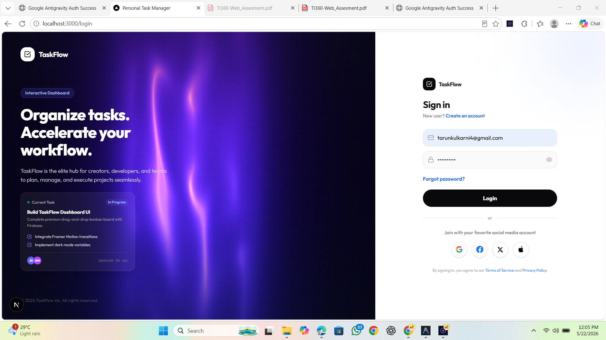
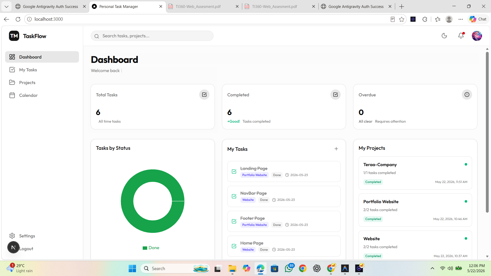
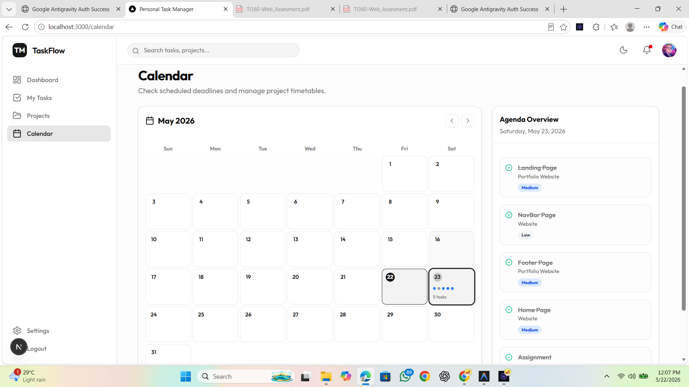
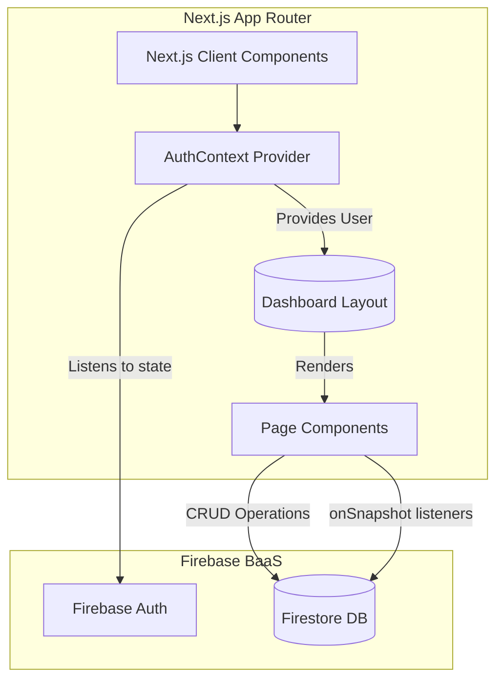

# TaskFlow — Personal Task Manager

> **Submission for Terrainfra360 Web Developer Assignment**
> Deadline: 23 May 2026, 12:00 PM IST

A clean, responsive, full-stack personal task management application built with Next.js 14+, Tailwind CSS, Firebase, and Recharts. Users can sign up, create projects, manage tasks, and track their progress from a polished dashboard.

---

## 🚀 Links & Demo

- **GitHub Repository:** [taskflow-dashboard-terrainfra360-assignment](https://github.com/tarunkulkarni4/taskflow-dashboard-terrainfra360-assignment)
- **Deployed URL:** `https://YOUR-APP.vercel.app` *(replace after Vercel deployment)*
- **Demo Account:**
  - **Email:** `demo@taskflow.com`
  - **Password:** `Demo@1234`

> The demo account is pre-loaded with sample projects and tasks so reviewers can explore all features immediately.

---

## 📸 Screenshots

### Login Page


### Dashboard


### Task Management


### Calendar View


---

## ✅ Feature Checklist

### Required Features
- [x] **Login / Sign-up page** — Firebase email/password authentication + Google Sign-In
- [x] **Dashboard** — 3 summary cards: Total Tasks, Completed This Week, Overdue Tasks
- [x] **Dashboard Chart** — Pie chart (Recharts) showing tasks by status (Todo / In Progress / Done)
- [x] **Projects page** — List all projects, create new project, delete project
- [x] **Project detail page** — List tasks for a project, add task, mark task as done/in-progress, delete task
- [x] **Project fields:** name, created date (with time)
- [x] **Task fields:** title, status (Todo / In Progress / Done), due date, priority (Low / Medium / High)
- [x] **Responsive UI** — works cleanly on mobile (~375px) and desktop
- [x] **Loading states** — skeleton screens on all pages during data fetch
- [x] **Empty states** — friendly messages when no data exists

### Bonus Features Implemented
- [x] **TypeScript** — entire codebase is written in TypeScript
- [x] **Framer Motion animations** — card hover effects, page fade-ins, list item animations
- [x] **Filter tasks** — filter by All / Active / Completed status on the My Tasks page
- [x] **Light / Dark mode toggle** — Sun/Moon button in the header, powered by `next-themes`
- [x] **Search bar** — full-text search across task titles and project names

---

## 🏗️ Architecture & Design Decisions

### System Architecture & Data Flow



**How it works:**
1. **Authentication Flow:** When the app loads, `AuthContext` listens to `Firebase Auth`. If no user is detected, they are redirected to the `(auth)/login` route.
2. **Data Fetching:** Once authenticated, the user is redirected to `(dashboard)`. Pages inside the dashboard mount and immediately attach an `onSnapshot` listener to Firestore using the user's `uid`.
3. **Real-time Sync:** When a user creates/edits/deletes a task or project, the mutation is sent directly to Firestore. Because of the `onSnapshot` listener, the frontend instantly receives the updated collection and triggers a re-render without manual refetching.

### Folder Structure
```
src/
├── app/
│   ├── (auth)/login/          # Login & Sign-up page (route group, no layout)
│   └── (dashboard)/           # All authenticated pages share sidebar + header layout
│       ├── page.tsx            # Dashboard (summary cards + chart)
│       ├── tasks/              # My Tasks — all tasks across projects
│       ├── projects/           # Projects list
│       ├── projects/[id]/      # Project detail — task management
│       ├── calendar/           # Calendar view of due dates
│       └── settings/           # Settings page
├── components/
│   ├── layout/
│   │   ├── header.tsx          # Top bar: search, dark mode toggle, user menu
│   │   └── sidebar.tsx         # Left nav (desktop) / slide-in drawer (mobile)
│   └── ui/                     # Shadcn UI + custom components
├── lib/
│   ├── firebase.ts             # Firebase app initialization
│   ├── AuthContext.tsx         # Global auth state + redirect logic
│   └── utils.ts                # Tailwind class merging utility
```

### Key Design Decisions

1. **Route Groups** — `(auth)` and `(dashboard)` route groups allow different layouts without affecting the URL. The dashboard layout injects the sidebar and header automatically into every child page.

2. **Real-time Firestore listeners** — All data pages use `onSnapshot` for live updates. A single listener per page is used (not multiple), and it is properly cleaned up on unmount via the `useEffect` return function to prevent "permission-denied" errors on logout.

3. **Minimum skeleton delay** — A 2-second minimum loading state is enforced using `Promise.race` to avoid jarring flash-of-content on fast connections.

4. **Optimistic UI** — Task status toggling and deletion update the local state immediately before waiting for Firestore confirmation, giving a snappy feel.

5. **Mobile sidebar** — The sidebar is hidden on mobile and replaced with a hamburger menu button in the header. Tapping a nav link auto-closes the drawer.

6. **Dark mode** — Implemented with `next-themes` (`ThemeProvider` wraps the entire app). The `attribute="class"` strategy applies a `dark` class to `<html>`, which is what Tailwind's dark mode variant targets.

---

## 🛠️ Tech Stack

| Technology | Purpose |
|---|---|
| **Next.js 14+ (App Router)** | Full-stack React framework |
| **React 18** | UI library |
| **TypeScript** | Type safety across the codebase |
| **Tailwind CSS** | Utility-first styling |
| **Shadcn UI** | Accessible, pre-built component primitives |
| **Firebase Auth** | Email/password + Google authentication |
| **Firebase Firestore** | NoSQL real-time database (Spark free tier) |
| **Recharts** | Dashboard pie chart for task status breakdown |
| **Framer Motion** | Page transitions and micro-animations |
| **next-themes** | Light/dark mode toggle |
| **Sonner** | Toast notification system |
| **Lucide React** | Icon library |

---

## ⚙️ Setup & Run Instructions

### 1. Clone the repository

```bash
git clone https://github.com/YOUR_USERNAME/YOUR_REPO.git
cd YOUR_REPO
```

### 2. Install dependencies

```bash
npm install
```

### 3. Configure environment variables

Create a `.env.local` file in the project root. Copy the keys from your Firebase project settings:

```env
NEXT_PUBLIC_FIREBASE_API_KEY=your_api_key_here
NEXT_PUBLIC_FIREBASE_AUTH_DOMAIN=your_project_id.firebaseapp.com
NEXT_PUBLIC_FIREBASE_PROJECT_ID=your_project_id
NEXT_PUBLIC_FIREBASE_STORAGE_BUCKET=your_project_id.appspot.com
NEXT_PUBLIC_FIREBASE_MESSAGING_SENDER_ID=your_sender_id
NEXT_PUBLIC_FIREBASE_APP_ID=your_app_id
```

> ⚠️ Never commit `.env.local` to Git. See `.env.example` for the required variable names.

### 4. Configure Firebase

In your [Firebase Console](https://console.firebase.google.com/):

1. **Authentication** → Enable **Email/Password** and **Google** sign-in providers.
2. **Firestore Database** → Create a database in **production mode**, then add these security rules:

```
rules_version = '2';
service cloud.firestore {
  match /databases/{database}/documents {
    match /tasks/{taskId} {
      allow read, write: if request.auth != null && request.auth.uid == resource.data.userId;
      allow create: if request.auth != null && request.auth.uid == request.resource.data.userId;
    }
    match /projects/{projectId} {
      allow read, write: if request.auth != null && request.auth.uid == resource.data.userId;
      allow create: if request.auth != null && request.auth.uid == request.resource.data.userId;
    }
    match /users/{userId} {
      allow read, write: if request.auth != null && request.auth.uid == userId;
    }
  }
}
```

### 5. Run the development server

```bash
npm run dev
```

Open [http://localhost:3000](http://localhost:3000) in your browser.

---

## 🚢 Deployment (Vercel)

1. Push the repository to GitHub.
2. Go to [vercel.com](https://vercel.com) → **Add New Project** → import the GitHub repo.
3. In the **Environment Variables** section, add all variables from `.env.local`.
4. Click **Deploy**. Vercel auto-detects Next.js and builds it correctly.

---

## 🧪 Testing Evidence

### Manual Testing Checklist
| Scenario | Result |
|---|---|
| Sign up with new email | ✅ Account created, redirected to dashboard |
| Sign in with wrong password | ✅ Error toast shown |
| Sign in with Google | ✅ Google popup, account saved to Firestore |
| Create a new project | ✅ Appears in project list with creation date/time |
| Delete a project | ✅ Confirmation toast, removed from list |
| Add task to project (with status + priority) | ✅ Saved to Firestore, appears in list instantly |
| Toggle task status (Todo → In Progress → Done) | ✅ Cycles through all 3 states |
| Delete a task | ✅ Removed from Firestore |
| Dashboard cards reflect live data | ✅ Total, completed this week, overdue all correct |
| Pie chart shows correct breakdown | ✅ Updates in real-time as tasks change |
| Dark mode toggle | ✅ Persists across page navigation |
| Mobile sidebar hamburger | ✅ Opens/closes correctly, auto-closes on nav |
| Loading skeletons | ✅ Show on all pages for 2 seconds minimum |
| Empty state | ✅ Shown when no tasks/projects exist |
| Log out | ✅ Signed out from Firebase, redirected to login |

---

## 📁 `.env.example`

```env
NEXT_PUBLIC_FIREBASE_API_KEY=
NEXT_PUBLIC_FIREBASE_AUTH_DOMAIN=
NEXT_PUBLIC_FIREBASE_PROJECT_ID=
NEXT_PUBLIC_FIREBASE_STORAGE_BUCKET=
NEXT_PUBLIC_FIREBASE_MESSAGING_SENDER_ID=
NEXT_PUBLIC_FIREBASE_APP_ID=
```

---

## 📄 License

This project was built as a submission for the Terrainfra360 Web Developer Assignment. Not for commercial use.
